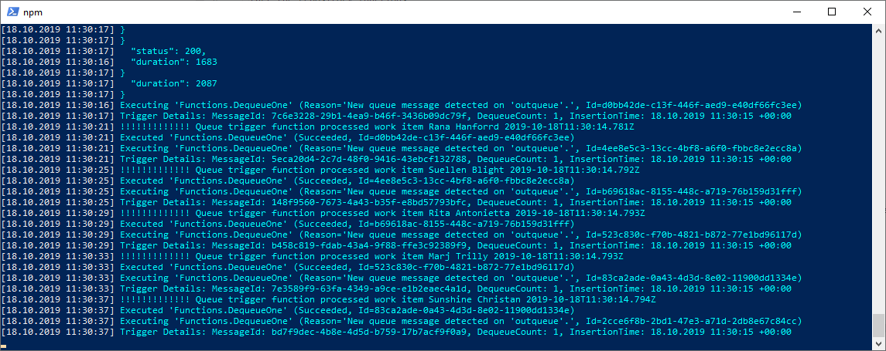

# Singleton Storage Queue processing demonstration
> Process the Azure storage queue messages one at the time via the azure function storage queue trigger

## Setup
* Install & start the azure storage emulator https://docs.microsoft.com/en-us/azure/storage/common/storage-use-emulator
* Install & start the repository functions 
````
npm install
npm start
````
* When the api is up execute the call script
```
node add-a-lot.js
``` 

## Description:
* The `add-a-lot.js` script calls the http trigger `AddOne` 10 times. 
* The `AddOne` function adds messages on each call from the request body to the storage queue in the azure storage emulator
* The storage queue triggered function `DequeueOne` consumes the messages one at the time and logs them every 4 seconds to the console (`"!!!!!..."`)

* The queue concurrency is set via `extensions.queues.batchSize = 1` in [host.json](./host.json) ([source](https://github.com/Azure/azure-functions-host/wiki/host.json))
